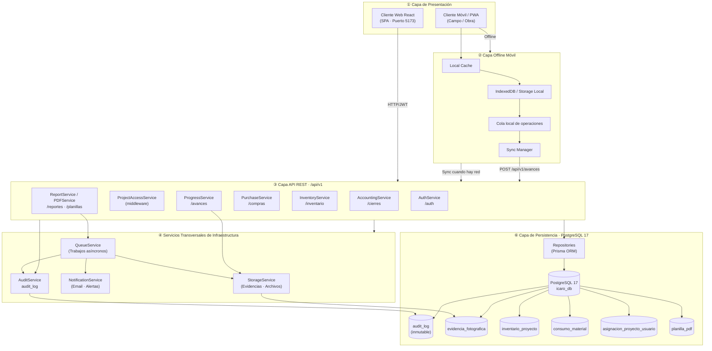

# Diseño Arquitectónico — Sistema ICARO v2
## Sistema de Gestión Integral · ICARO CONSTRUCTORES BMGM S.A.S.

**Versión:** 2.0
**Fecha:** 2026-04-25
**Autores:** Isaac Sebastián Castro Muesmueran · Ivan Santiago Pulgar León
**Director:** Ing. Jaime David Camacho Castillo
**Historial:** v1.0 (2026-04-19) → v2.0 (2026-04-25) · Corrección de inconsistencias críticas INC-ARQ-01/02/03, INC-AUD-01, INC-FOR-02

---

## 1. Contexto y Requisitos que Orientan la Arquitectura

### 1.1 Descripción del Sistema

ICARO es un ERP (Enterprise Resource Planning) corporativo especializado para empresas constructoras desarrollado para **ICARO CONSTRUCTORES BMGM S.A.S.** Gestiona:

- Control de avance de obra por rubros presupuestados
- Requerimientos y procesos de compra
- Inventario de materiales por proyecto
- Cierres contables mensuales con trazabilidad
- Generación de planillas PDF con hash de integridad
- Seguridad multi-rol con auditoría inmutable
- Registro de evidencias fotográficas de obra en campo
- Operación offline para residentes en campo sin conectividad permanente

### 1.2 Atributos de Calidad (Drivers Arquitectónicos)

| Atributo | Prioridad | Implicación |
|----------|-----------|-------------|
| **Seguridad** | Crítica | Datos financieros y contractuales sensibles. Multi-rol RBAC obligatorio. |
| **Trazabilidad** | Crítica | Auditoría inmutable de cada CUD mediante `audit_log`. Requisito legal/contractual. |
| **Disponibilidad** | Alta | Operación en campo (obra) puede ser intermitente. Requiere modo offline con sincronización posterior. |
| **Escalabilidad horizontal** | Media | Múltiples proyectos simultáneos. Crece por proyecto, no por carga masiva. |
| **Mantenibilidad** | Alta | Equipo pequeño. El código debe ser simple de extender módulo a módulo. |
| **Performance** | Media | Usuarios concurrentes: < 50. P95 < 2000 ms. No es un sistema de alta concurrencia. |

---

## 2. Arquitectura Seleccionada

### 2.1 Estilo Arquitectónico Principal: Layered Monolith con API REST

Se seleccionó una arquitectura de **Monolito en Capas** para el backend, expuesto como **API REST**, combinado con un **SPA/PWA React** como cliente web, y un **cliente móvil/PWA** con capacidades offline para uso en campo.

### 2.2 Organización en Capas (v2)

La arquitectura v2 se organiza en seis capas explícitas:

| Capa | Componentes |
|------|-------------|
| **1. Presentación** | Cliente Web React · Cliente Móvil/PWA · Interfaces por rol |
| **2. Offline Móvil** | Local Cache · IndexedDB · Sync Manager · Cola local de operaciones |
| **3. Aplicación / API REST** | AuthService · ProjectAccessService · ProgressService · PurchaseService · InventoryService · AccountingService · ReportService/PDFService |
| **4. Infraestructura Transversal** | StorageService · QueueService · NotificationService · AuditService |
| **5. Dominio** | Entidades · Reglas de negocio · Restricciones por proyecto |
| **6. Persistencia** | Repositories · PostgreSQL 17 · audit_log · tablas de negocio |

---

## 3. Diagrama de Arquitectura Lógica v2



---

## 4. Diagrama de Flujo de una Petición

```
Usuario                Frontend               Backend              PostgreSQL
  │                       │                      │                     │
  │── Login (email/pwd) ──▶│                      │                     │
  │                        │── POST /auth/login ──▶│                     │
  │                        │                      │── findUnique ───────▶│
  │                        │                      │◀── usuario+rol ─────│
  │                        │                      │── bcrypt.compare()   │
  │                        │                      │── jwt.sign() ──┐     │
  │                        │◀── { token, user } ──│                │     │
  │◀── Redirige /dashboard │                      │                │     │
  │                        │                      │                │     │
  │── Pide lista usuarios──▶│                      │                │     │
  │                        │── GET /users ─────────▶│               │     │
  │                        │  Bearer: <token>      │               │     │
  │                        │                      │── requireAuth  │     │
  │                        │                      │── jwt.verify() │     │
  │                        │                      │── requireRole([ADMIN])
  │                        │                      │── findMany() ──────▶│
  │                        │                      │◀── [usuarios] ──────│
  │                        │                      │── auditMiddleware    │
  │                        │◀── { data, meta } ───│    (async, post-res) │
  │◀── Tabla de usuarios───│                      │── AuditService ─────▶│
```

---

## 5. Diagrama de Despliegue (Docker Compose)

```
╔══════════════════════════════════════════════════════════════════════════╗
║                    ENTORNO DE DESPLIEGUE — Docker Compose               ║
║                         Red Interna: icaro_network                      ║
║                                                                          ║
║  ┌────────────────────┐     ┌─────────────────────────────────────────┐ ║
║  │  icaro_frontend    │     │          icaro_backend                  │ ║
║  │  (React + Vite)    │     │       (Node.js + Express)               │ ║
║  │  Puerto: 5173      │────▶│       Puerto: 3001                      │ ║
║  │  • AuthContext     │HTTP │  Middlewares:                            │ ║
║  │  • React Router    │     │  ├─ helmet · cors · morgan              │ ║
║  │  • Axios + JWT     │     │  ├─ auditMiddleware (CUD→audit_log)     │ ║
║  │  • usersApi.js     │     │  ├─ requireAuth (JWT HS256)             │ ║
║  │  • PWA / offline   │     │  ├─ requireRole (RBAC)                  │ ║
║  └────────────────────┘     │  └─ requireProjectAccess                │ ║
║        :5173                │                                          │ ║
║                             │  Servicios Transversales:               │ ║
║                             │  ├─ AuditService → audit_log           │ ║
║                             │  ├─ StorageService → evidencias         │ ║
║                             │  ├─ QueueService → planillas PDF        │ ║
║                             │  └─ NotificationService → alertas       │ ║
║                             │                                          │ ║
║                             │  ORM: Prisma Client v5                  │ ║
║                             └──────────────────┬────────────────────────┘║
║                                                │ TCP 5432                ║
║                             ┌──────────────────▼────────────────────────┐║
║                             │          icaro_db                         │║
║                             │       (PostgreSQL 17-alpine)              │║
║                             │       Puerto: 5432                        │║
║                             │  Esquema: 14+ modelos                    │║
║                             │  ├─ roles, usuarios                       │║
║                             │  ├─ asignacion_proyecto_usuario           │║
║                             │  ├─ proyectos, rubros                     │║
║                             │  ├─ avance_obra, evidencia_fotografica    │║
║                             │  ├─ requerimiento_compra, detalle_req     │║
║                             │  ├─ inventario_proyecto, materiales       │║
║                             │  ├─ cierre_mensual, planilla_pdf          │║
║                             │  └─ audit_log (inmutable, BigInt PK)     │║
║                             └───────────────────────────────────────────┘║
╚═══════════════════════════════════════════════════════════════════════════╝
```

---

## 6. Patrones Arquitectónicos Adoptados

### 6.1 Patrón: Layered Architecture (Capas)

El backend se organiza en 5 capas con dependencias unidireccionales (hacia abajo):

```
Middlewares → Rutas → Controladores → Servicios → Prisma (Datos)
```

**Justificación:**
- Cada capa tiene una única responsabilidad (SRP de SOLID)
- Permite testear capas de forma independiente
- El equipo puede extender un módulo sin tocar las otras capas

### 6.2 Patrón: RBAC — Role-Based Access Control

El acceso a recursos se controla mediante **roles predefinidos**, no por usuario individual.

| Rol | Módulos accesibles |
|-----|-------------------|
| Administrador del Sistema | Todos (usuarios, auditoría, configuración) |
| Presidente / Gerente | Proyectos, Avances, Compras, Reportes |
| Contador | Proyectos, Compras, Cierres, Reportes |
| Residente | Proyectos, Avances, Compras, Inventario |
| Auxiliar de Contabilidad | Compras, Cierres (soporte) |
| Bodeguero | Inventario, Movimientos |

### 6.3 Patrón: JWT Stateless Authentication

La autenticación no requiere sesiones en servidor. El token JWT contiene el payload (`id`, `email`, `rol`, `idRol`) firmado con **HS256**, con expiración de 8 horas.

### 6.4 Patrón: Audit Log Inmutable (Append-Only)

La tabla `audit_log` nunca recibe `UPDATE` ni `DELETE`. Solo se escribe con `INSERT`, garantizando trazabilidad irreversible. Ver Sección 9 para detalle.

### 6.5 Patrón: API-First (REST con versionamiento)

```
/api/v1/auth/*       ← Autenticación pública
/api/v1/users/*      ← Gestión de usuarios (solo Admin)
/api/v1/proyectos/*  ← RBAC + Control por fecha y asignación
/api/v1/avances/*    ← Registro de avance de obra
/api/v1/compras/*    ← Requerimientos de compra
/api/v1/inventario/* ← Movimientos de stock
/api/v1/cierres/*    ← Cierres contables mensuales
/api/v1/reportes/*   ← Reportes ejecutivos y planillas PDF
```

---

## 7. Capa Offline Móvil (NUEVA — v2)

> **Contexto:** Los residentes de obra trabajan en campo con conectividad intermitente o nula. El sistema debe permitir registrar avances físicos, consumos de materiales y evidencias fotográficas sin necesidad de conexión permanente a Internet.

### 7.1 Descripción

La arquitectura móvil incorpora una **capa offline** compuesta por almacenamiento local, gestor de sincronización y cola de operaciones pendientes. Esta capa permite registrar avances físicos, consumos de materiales y evidencias fotográficas aun cuando el dispositivo no tenga conectividad. Una vez restablecida la conexión, el `SyncManager` reintenta la transmisión hacia la API REST, actualiza el estado de sincronización y evita la pérdida de información operativa generada en campo.

### 7.2 Componentes de la Capa Offline

| Componente | Responsabilidad |
|------------|----------------|
| **Local Cache** | Almacena respuestas de API recientes para lectura offline (proyectos, rubros, materiales). Estrategia: Cache-First para recursos estáticos, Network-First para datos dinámicos. |
| **IndexedDB / Storage Local** | Base de datos estructurada en el cliente. Persiste registros de avances, consumos y rutas de evidencias fotográficas pendientes de sincronización. |
| **Cola Local de Operaciones** | Cola FIFO que registra cada operación CUD ejecutada offline (tipo, payload, timestamp, intentos). Garantiza orden de ejecución al sincronizar. |
| **Sync Manager** | Detecta cambio de estado de conectividad (`online/offline`). Al recuperar conexión, procesa la cola local, envía operaciones a la API y actualiza el estado de cada registro. |
| **Resolución de Conflictos** | Estrategia básica: "last-write-wins" con timestamp del cliente. Conflictos críticos (solapamiento de avances) se marcan para revisión manual por el Administrador. |
| **Indicadores Visuales** | Cada registro pendiente muestra estado: `⏳ Pendiente`, `✅ Sincronizado`, `❌ Error`. El ícono de conectividad global refleja el estado de la cola. |

### 7.3 Flujo Offline → Sincronización

```
[Residente en campo — sin internet]
        │
        ▼
[Registra avance en UI]
        │
        ▼
[IndexedDB: INSERT avance_local {payload, timestamp, estado: 'PENDIENTE'}]
        │
        ▼
[Cola Local: enqueue({tipo: 'POST', ruta: '/avances', payload})]
        │
   ... tiempo ...
        │
[Dispositivo recupera conexión]
        │
        ▼
[Sync Manager: detecta 'online' event]
        │
        ▼
[Procesa cola: POST /api/v1/avances con JWT]
        │
        ├─ 201 Created → estado: 'SINCRONIZADO', eliminar de cola
        └─ 4xx/5xx    → estado: 'ERROR', reintento en N minutos
```

### 7.4 Consideraciones Técnicas

- **Service Worker**: Registrado en `main.jsx` via `vite-plugin-pwa`. Controla la caché de recursos estáticos (HTML, JS, CSS, íconos).
- **IndexedDB**: Acceso vía librería `idb` o equivalente. Schemas: `avances_pendientes`, `consumos_pendientes`, `evidencias_pendientes`.
- **Límite de almacenamiento**: Se advierte al usuario cuando la cola supera 50 registros o el storage local supera el 80% de capacidad.
- **Seguridad offline**: Los tokens JWT se almacenan en memoria (no en localStorage) para minimizar riesgo XSS. La cola local no contiene datos financieros sensibles completos.

---

## 8. Servicios Transversales de Infraestructura (NUEVA — v2)

### 8.1 StorageService

> **Contexto:** El sistema gestiona evidencias fotográficas de obra y planillas PDF que deben almacenarse de forma persistente, asociarse a proyectos/usuarios y ser recuperables mediante URL.

**Responsabilidades:**

- Recepción de archivos (imágenes, PDFs) desde la API REST
- Validación de formato (`image/jpeg`, `image/png`, `application/pdf`)
- Validación de tamaño (máx. configurable por tipo)
- Compresión/normalización de imágenes antes del almacenamiento
- Almacenamiento lógico o físico con nombre único (UUID + extensión)
- Asociación de la evidencia con el `avance_obra`, `rubro`, `proyecto` y `usuario` que la originó
- Generación y entrega de URL o referencia de consulta
- Soporte para planillas PDF como artefactos adjuntables al cierre contable

**Posición en la arquitectura:** Capa de infraestructura transversal. Lo invocan: `ProgressService`, `AccountingService`, `QueueService`.

**Integración con el modelo de datos:**

```
avance_obra  ──────────▶  evidencia_fotografica
                              ├─ id (UUID)
                              ├─ idAvance (FK)
                              ├─ nombreArchivo
                              ├─ urlArchivo  ← generado por StorageService
                              ├─ tamaño
                              └─ timestamp
```

### 8.2 QueueService

> **Contexto:** La generación de planillas PDF (cierre mensual → rendering HTML/CSS → PDF) es computacionalmente costosa y no debe bloquear el hilo principal ni la respuesta HTTP al usuario.

**Responsabilidades:**

- Recepción de trabajos de generación diferida (planillas PDF, reportes pesados)
- Procesamiento asíncrono desacoplado del ciclo request-response
- Control de estado de trabajos: `PENDIENTE → EN_PROCESO → COMPLETADO | ERROR`
- Reintentos automáticos ante fallos transitorios (máx. configurable)
- Desacoplamiento entre la solicitud del usuario (POST /planillas) y la generación real del archivo
- Notificación al `NotificationService` cuando el trabajo completa o falla
- Almacenamiento del artefacto resultante mediante `StorageService`

**Flujo:**

```
POST /api/v1/cierres/:id/generar-planilla
        │
        ▼
[AccountingService: valida cierre]
        │
        ▼
[QueueService: enqueue({tipo: 'PDF', idCierre, idUsuario})]
        │
[HTTP 202 Accepted → "Su planilla está siendo generada"]
        │                            │
   ... async ...                     │
        │                            │
[QueueService: procesa trabajo]      │
        ├─ Genera PDF                │
        ├─ StorageService: guarda    │
        ├─ UPDATE planilla_pdf       │
        └─ NotificationService: avisa usuario
```

**Posición:** Infraestructura transversal. Se conecta con `AccountingService`, `StorageService`, `NotificationService`, `AuditService` y la BD.

### 8.3 NotificationService

> **Contexto:** El sistema genera eventos significativos (planilla lista, requerimiento aprobado/rechazado, error de sincronización) que deben comunicarse a los usuarios afectados.

**Responsabilidades:**

- Notificaciones de planillas PDF listas para descarga
- Notificaciones de aprobación o rechazo de requerimientos de compra
- Avisos de errores críticos de sincronización
- Alertas funcionales configurables por rol
- Envío por correo electrónico u otro canal futuro (push notifications, SMS)

**Abstracción:** El `NotificationService` no queda acoplado a ningún proveedor específico. La implementación interna puede usar Nodemailer, SendGrid, o cualquier proveedor configurable mediante variables de entorno. El resto de la aplicación solo invoca `notificationService.send({ destinatario, asunto, plantilla, datos })`.

### 8.4 AuditService

> **Contexto:** Toda operación CUD del sistema debe quedar registrada de forma trazable, asociada al usuario, IP, módulo y datos afectados. Ver también Sección 9.

**Responsabilidades:**

- Registro de operaciones `INSERT`, `UPDATE`, `DELETE` en la tabla `audit_log`
- Captura de datos antes y después de cada operación (`datosAntes`, `datosDespues` en JSONB)
- Registro de IP de origen (incluyendo soporte para `X-Forwarded-For` en reverse proxy)
- Trazabilidad de cierres contables, cambios de inventario, aprobaciones, accesos denegados y generación de planillas
- Nunca interrumpe el flujo principal (errores internos se registran en consola, no propagan excepción)

**Implementación en dos niveles:**

| Nivel | Mecanismo | Cubre |
|-------|-----------|-------|
| Aplicación | `audit.middleware.js` + `audit.service.js` | Todas las rutas /api/v1 con método POST/PUT/PATCH/DELETE |
| Base de datos | Triggers BEFORE UPDATE / BEFORE DELETE sobre `audit_log` | Protección contra modificación directa vía psql o herramientas externas |

---

## 9. Auditoría Técnica y Trazabilidad (ACTUALIZADA — v2)

### 9.1 Entidad audit_log

La arquitectura incorpora un mecanismo de auditoría transversal basado en la entidad `audit_log`, destinada a registrar operaciones críticas del sistema. Este registro conserva evidencia de acciones relevantes: creación, modificación, aprobación, rechazo, cierre contable, movimientos de inventario, accesos denegados y generación de planillas. La implementación se apoya en **middleware de aplicación** y puede reforzarse con **triggers de base de datos** para garantizar la integridad de los eventos.

**Campos de audit_log:**

| Campo | Tipo | Descripción |
|-------|------|-------------|
| `id` | BIGSERIAL | Clave primaria autoincremental |
| `tabla` | VARCHAR | Tabla de negocio afectada |
| `operacion` | ENUM | `INSERT` \| `UPDATE` \| `DELETE` |
| `id_registro` | UUID | Identificador del registro modificado |
| `id_usuario` | UUID | Usuario que ejecutó la acción |
| `datos_antes` | JSONB | Snapshot del estado previo (null en INSERT) |
| `datos_despues` | JSONB | Snapshot del estado posterior (null en DELETE) |
| `ip_origen` | INET | IP del cliente o X-Forwarded-For |
| `modulo` | VARCHAR | Módulo del sistema (/avances, /compras, etc.) |
| `timestamp` | TIMESTAMPTZ | Fecha y hora exacta con zona horaria (default NOW()) |

### 9.2 Garantía de Inmutabilidad

La inmutabilidad del `audit_log` se asegura en **dos niveles complementarios**:

1. **Nivel de aplicación:** `audit.service.logAction()` solo ejecuta `INSERT`. No existe ninguna ruta ni controlador que ejecute `UPDATE` o `DELETE` sobre `audit_log`.

2. **Nivel de base de datos (recomendado):** Agregar triggers que protejan la tabla ante modificaciones directas:

```sql
-- Trigger que impide UPDATE sobre audit_log
CREATE OR REPLACE FUNCTION audit_log_no_update()
RETURNS TRIGGER AS $$
BEGIN
  RAISE EXCEPTION 'Los registros de audit_log son inmutables. No se permiten modificaciones.';
END;
$$ LANGUAGE plpgsql;

CREATE TRIGGER trg_audit_log_no_update
BEFORE UPDATE ON audit_log
FOR EACH ROW EXECUTE FUNCTION audit_log_no_update();

-- Trigger que impide DELETE sobre audit_log
CREATE OR REPLACE FUNCTION audit_log_no_delete()
RETURNS TRIGGER AS $$
BEGIN
  RAISE EXCEPTION 'Los registros de audit_log son inmutables. No se permiten eliminaciones.';
END;
$$ LANGUAGE plpgsql;

CREATE TRIGGER trg_audit_log_no_delete
BEFORE DELETE ON audit_log
FOR EACH ROW EXECUTE FUNCTION audit_log_no_delete();
```

### 9.3 Operaciones Cubiertas por Auditoría

| Módulo | Operaciones auditadas |
|--------|-----------------------|
| Usuarios | Creación, edición, cambio de rol, activación/desactivación |
| Proyectos | Asignación y revocación de acceso por fecha |
| Avances de Obra | Registro, edición y aprobación de avances físicos |
| Compras | Creación, aprobación, rechazo de requerimientos |
| Inventario | Ingresos, salidas y ajustes de stock |
| Cierre Contable | Apertura, generación de planilla, cierre definitivo |
| Auditoría | Accesos denegados (403), tokens inválidos (401) |

---

## 10. Patrones de Despliegue y Tecnología

### 10.1 Docker Compose

El sistema se despliega mediante Docker Compose con cuatro servicios:

| Servicio | Imagen | Puerto |
|----------|--------|--------|
| `icaro_frontend` | node:alpine + React/Vite build | 5173 |
| `icaro_backend` | node:alpine + Express | 3001 |
| `icaro_db` | postgres:17-alpine | 5432 |
| `icaro_pgadmin` | pgadmin4 (solo dev) | 5050 |

### 10.2 Selección de Base de Datos: PostgreSQL 17

PostgreSQL es la elección correcta porque el dominio del ERP tiene relaciones complejas entre proyectos, rubros, usuarios y auditoría que requieren integridad referencial estricta, soporte JSONB nativo para los campos de auditoría, y transacciones ACID para los cierres contables.

### 10.3 Selección de ORM: Prisma v5

Prisma ofrece type-safety, migraciones versionadas con Git, autocompletado y DX excelente para un equipo pequeño, con soporte nativo para PostgreSQL JSONB.

---

## 11. Frontend: PWA con React + Vite

### 11.1 Justificación del Stack

| Criterio | React 18 + Vite ✅ | Next.js | Angular |
|----------|--------------------|---------|---------|
| Modo PWA (offline) | Sí (vite-plugin-pwa) | Sí | Sí |
| Bundle size | Pequeño | Mediano | Grande |
| SSR necesario | No (ERP login-required) | Innecesario | Innecesario |

### 11.2 Patrón: Context API + Axios Interceptors

```
AuthContext (React Context)
    │
    ├─ user: { id, nombre, rol }
    ├─ isAuthenticated: boolean
    ├─ login() / logout()
    └─ Se inyecta en toda la app vía <AuthProvider>

Axios Instance
    │
    ├─ Interceptor request: añade 'Authorization: Bearer <token>'
    └─ Interceptor response: captura 401 → fuerza logout + redirect /login
```

---

## 12. Flujo de Seguridad Completo

```
Request entrante
      │
  requireAuth → ¿Token válido? → No: 401/403
      │
  requireRole([roles]) → ¿Rol autorizado? → No: 403
      │
  requireProjectAccess → ¿Asignado y vigente? → No: 403
      │
  Controller → Lógica de negocio
      │
  AuditService (post-response) → INSERT audit_log
```

---

## 13. Estructura de Archivos del Proyecto

```
Sistema_ICARO/
├── docker-compose.yml
│
├── backend/
│   ├── src/
│   │   ├── server.js               ← Entry point
│   │   ├── middlewares/
│   │   │   ├── auth.middleware.js  ← requireAuth, requireRole, ROLES
│   │   │   ├── audit.middleware.js ← Auditoría automática CUD global
│   │   │   └── projectAccess.middleware.js
│   │   ├── controllers/
│   │   │   ├── auth.controller.js
│   │   │   └── users.controller.js
│   │   ├── routes/
│   │   │   ├── auth.routes.js
│   │   │   ├── users.routes.js     ← Solo ADMIN
│   │   │   └── proyectos.routes.js
│   │   ├── services/
│   │   │   ├── audit.service.js    ← AuditService: logAction, logFromRequest
│   │   │   ├── storage.service.js  ← StorageService (v2)
│   │   │   ├── queue.service.js    ← QueueService (v2)
│   │   │   └── notification.service.js ← NotificationService (v2)
│   │   └── utils/
│   │       └── jwt.js
│   ├── prisma/
│   │   ├── schema.prisma           ← 14+ modelos
│   │   └── migrations/
│   └── tests/
│       └── security.test.js        ← 15/15 pruebas PASS
│
└── frontend/
    └── src/
        ├── store/
        │   └── AuthContext.jsx
        ├── services/
        │   └── usersApi.js
        ├── utils/
        │   ├── axios.js            ← Interceptors JWT
        │   ├── offlineQueue.js     ← Cola local (v2)
        │   └── syncManager.js      ← Sync Manager (v2)
        └── views/
```

---

## 14. Decisiones Arquitectónicas Rechazadas

| Alternativa | Por qué fue rechazada |
|-------------|----------------------|
| **Microservicios** | Complejidad operacional innecesaria para < 50 usuarios y equipo pequeño. |
| **GraphQL** | REST predecible y testeable es suficiente para el modelo de datos relacional definido. |
| **MongoDB** | Las relaciones entre proyectos, rubros, usuarios y auditoría requieren integridad referencial estricta. |
| **Sesiones con Redis** | JWT stateless es suficiente. Redis añade un servicio extra sin beneficio medible a esta escala. |
| **Next.js SSR** | El ERP es 100% privado (requiere login). SSR no aporta valor sin SEO público. |
| **Kubernetes** | Innecesario para la escala actual. Docker Compose garantiza reproducibilidad con mínima complejidad. |
| **S3StorageService** | El nombre genérico `StorageService` evita acoplamiento a AWS. La implementación puede ser local, MinIO, S3 o cualquier proveedor configurable. |
| **BullPDFQueue** | El nombre genérico `QueueService` evita acoplamiento a Bull/Redis. La implementación puede variar sin cambiar la interfaz. |

---

## 15. Evidencia de Cumplimiento por Actividad

| Actividad | Criterio de Aceptación | Componentes que lo garantizan |
|-----------|------------------------|-------------------------------|
| Act. 6 — RBAC | Acceso restringido por rol | `requireRole()` + constante `ROLES` + `MODULE_ROLES` |
| Act. 7 — Auditoría | Toda CUD registra ID, fecha, IP, acción | `AuditService.logAction()` + `audit.middleware.js` + triggers BD |
| Act. 8 — Gestión Usuarios | Admin crea y asigna roles dinámicamente | `users.controller.js` + `usersApi.getRoles()` + `AdminUsersPermissionsView` |
| Act. 9 — Control Proyecto | Middleware valida Token vs Proyecto y fechas | `requireProjectAccess` + `asignacion_proyecto_usuario` |
| Act. 10 — Pruebas JWT | 403 Forbidden ante accesos no autorizados | `security.test.js` — 15/15 pruebas ✅ |
| **v2** — Offline Móvil | Registro sin conectividad + sincronización | `SyncManager` + `LocalCache` + `IndexedDB` + `Cola Local` |
| **v2** — StorageService | Almacenamiento de evidencias fotográficas | `storage.service.js` + modelo `evidencia_fotografica` |
| **v2** — QueueService | Generación diferida de planillas PDF | `queue.service.js` + `planilla_pdf` + `NotificationService` |
| **v2** — AuditService | Inmutabilidad a nivel de BD | Triggers BEFORE UPDATE/DELETE sobre `audit_log` |

---

## 16. Resolución de Inconsistencias Críticas de Arquitectura

Con los cambios incorporados en la **Arquitectura v2**, el documento queda alineado con los requisitos funcionales, no funcionales, historias técnicas, plan de pruebas e informe de ejecución. La siguiente tabla registra el estado de cada inconsistencia detectada en el análisis:

| Código | Inconsistencia detectada | Cambio aplicado en Arquitectura v2 | Estado |
|--------|--------------------------|------------------------------------|--------|
| INC-ARQ-03 | No existía capa offline explícita para la app móvil. | Se agregó **Sección 7: Capa Offline Móvil** con Local Cache, IndexedDB, Sync Manager, Cola Local, indicadores visuales y flujo de sincronización. | ✅ Resuelta |
| INC-ARQ-01 | No estaba modelado el almacenamiento de evidencias fotográficas. | Se incorporó **`StorageService`** como servicio transversal de infraestructura en Sección 8.1, con responsabilidades, integración con el modelo de datos y posición en la arquitectura. | ✅ Resuelta |
| INC-ARQ-02 | No estaba modelado el procesamiento diferido de planillas PDF. | Se incorporó **`QueueService`** en Sección 8.2 con flujo de trabajo asíncrono, estados de trabajo y conexiones con StorageService y NotificationService. | ✅ Resuelta |
| INC-AUD-01 | La inmutabilidad de audit_log estaba solo a nivel de aplicación, sin respaldo en base de datos. | Se agregó **Sección 9.2** con los triggers SQL BEFORE UPDATE/BEFORE DELETE para PostgreSQL que garantizan inmutabilidad a nivel de motor de base de datos. | ✅ Resuelta |
| INC-FOR-02 | El nombre de la empresa aparecía con variantes inconsistentes ("ICAROCONSTRUCTORES", "ICARO CONSTRUCTORES", etc.). | Se unificó en todo el documento como **ICARO CONSTRUCTORES BMGM S.A.S.** | ✅ Resuelta |

> Con los cambios incorporados en la Arquitectura v2, el documento deja de presentar inconsistencias críticas de arquitectura. La solución queda alineada con los requisitos funcionales, requisitos no funcionales, historias técnicas, plan de pruebas e informe de ejecución, manteniendo la estructura base del documento original y reforzando únicamente los componentes necesarios para resolver las brechas detectadas.
