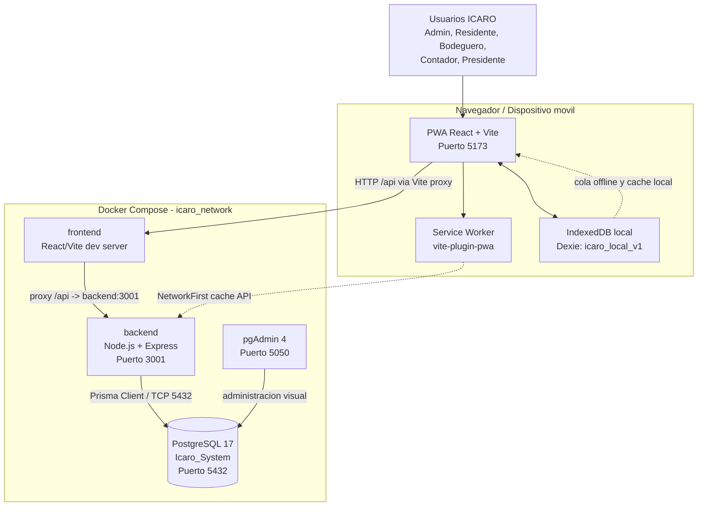
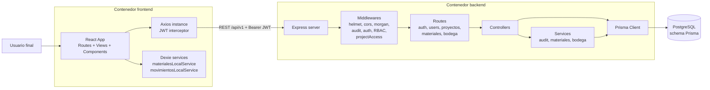
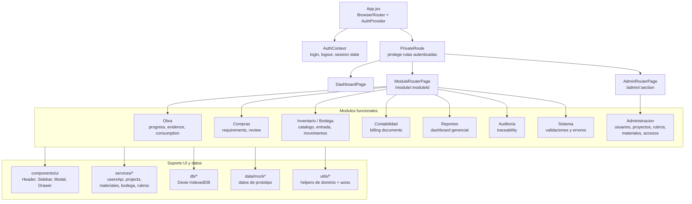
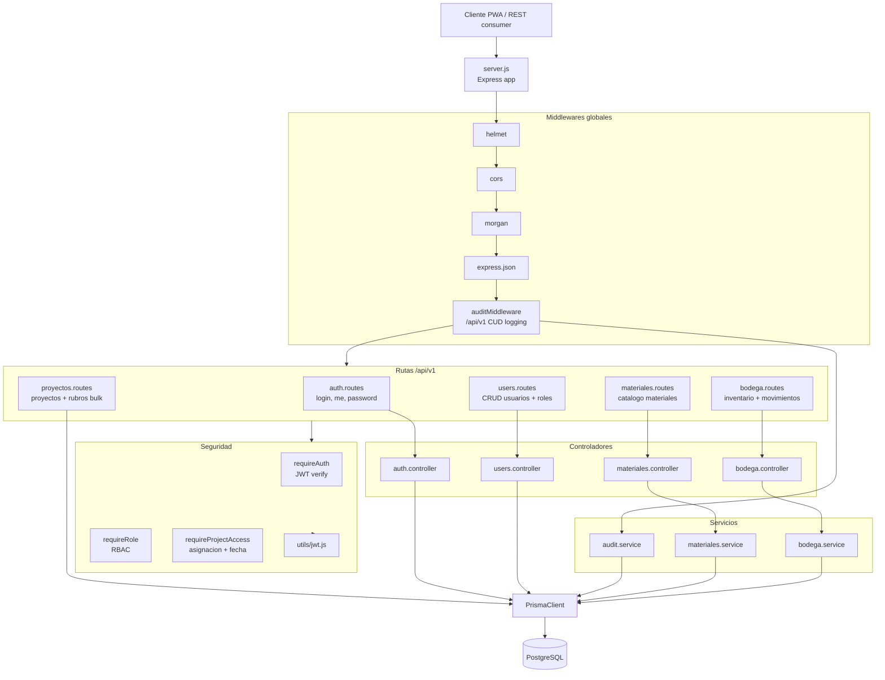
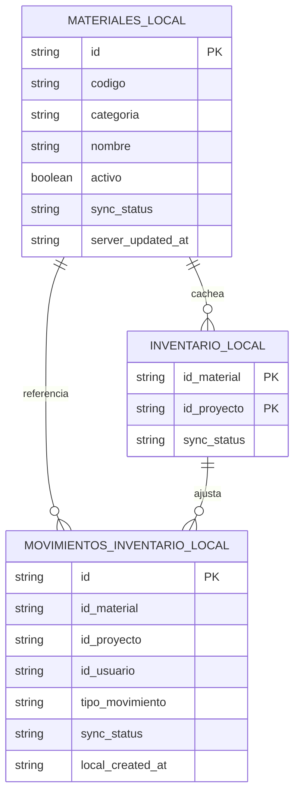
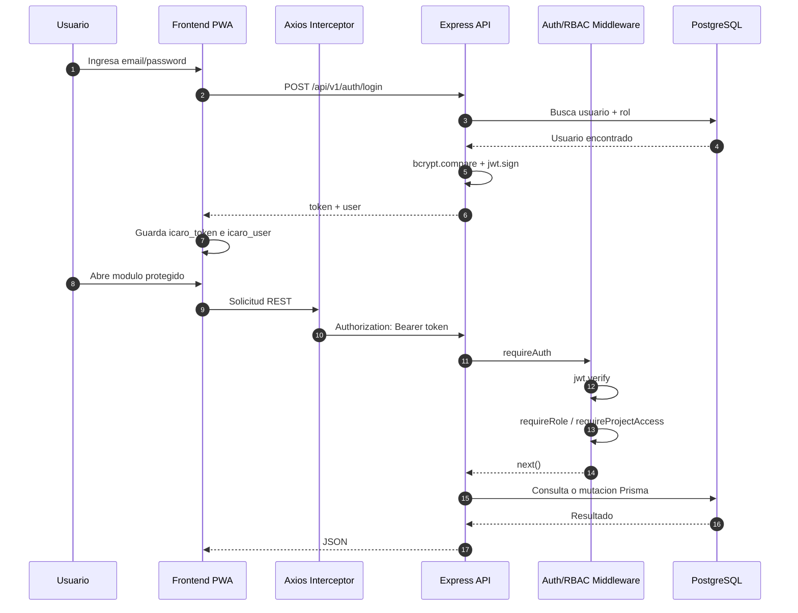
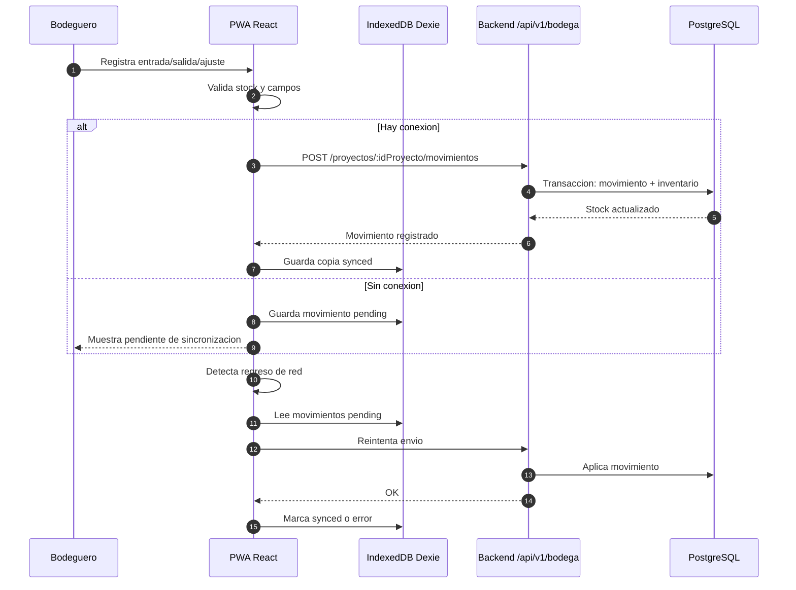

# Diagramas de Arquitectura - Sistema ICARO

Fecha de evaluacion: 2026-04-29

Este documento resume la arquitectura real observada en el repositorio. Se basa en `docker-compose.yml`, `backend/src/server.js`, `backend/prisma/schema.prisma`, `frontend/src/App.jsx`, los routers de frontend/backend y la configuracion PWA de Vite.

## 1. Evaluacion Arquitectonica

### Estilo principal

El proyecto implementa un **monolito modular en capas** con un cliente **SPA/PWA**:

- **Frontend:** React 18 + Vite + TailwindCSS + React Router + Axios + Dexie/IndexedDB.
- **Backend:** Node.js + Express + Prisma ORM + JWT + middlewares de seguridad, auditoria y acceso por proyecto.
- **Datos:** PostgreSQL 17, administrado en local con pgAdmin y migraciones Prisma.
- **Despliegue local:** Docker Compose con servicios `frontend`, `backend`, `db` y `pgadmin`.

### Fortalezas

- Separacion clara entre cliente, API y base de datos.
- Backend organizado por capas: rutas, controladores, servicios, middlewares y Prisma.
- Modelo relacional consistente con el dominio de construccion: proyectos, rubros, avances, compras, inventario, contabilidad y auditoria.
- Seguridad transversal con JWT, RBAC y validacion de acceso por proyecto.
- PWA con cache de API e IndexedDB para escenarios de trabajo offline en obra/bodega.
- Auditoria append-only modelada en `audit_log`, buena decision para trazabilidad contractual.

### Riesgos y observaciones

- El frontend contiene muchas vistas y datos mock; no todos los modulos visibles parecen integrados aun al backend.
- En backend estan activas las rutas de `auth`, `users`, `proyectos`, `materiales` y `bodega`; `avances`, `compras` y `reportes` aparecen previstos o representados en el modelo, pero no conectados como rutas activas en `server.js`.
- La documentacion anterior contiene caracteres rotos por codificacion; conviene normalizar a UTF-8 o mantener ASCII en documentos nuevos.
- Hay artefactos pesados dentro del arbol de trabajo (`node_modules`, `dist`, ZIPs y PDFs). Para analisis y control de versiones conviene excluirlos o confirmar que `.gitignore` los cubre.

## 2. Diagrama de Arquitectura General



## 3. Diagrama de Contenedores



## 4. Diagrama de Componentes Frontend



## 5. Diagrama de Componentes Backend



## 6. Diagrama de Base de Datos

```mermaid
erDiagram
  ROL ||--o{ USUARIO : asigna
  USUARIO ||--o{ ASIGNACION_PROYECTO_USUARIO : tiene
  PROYECTO ||--o{ ASIGNACION_PROYECTO_USUARIO : permite
  USUARIO ||--o{ PROYECTO : responsable

  PROYECTO ||--o{ RUBRO : contiene
  PROYECTO ||--o{ AVANCE_OBRA : registra
  RUBRO ||--o{ AVANCE_OBRA : avanza
  USUARIO ||--o{ AVANCE_OBRA : residente
  USUARIO ||--o{ AVANCE_OBRA : superintendente
  AVANCE_OBRA ||--o{ EVIDENCIA_FOTOGRAFICA : adjunta

  PROYECTO ||--o{ REQUERIMIENTO_COMPRA : solicita
  USUARIO ||--o{ REQUERIMIENTO_COMPRA : solicitante
  USUARIO ||--o{ REQUERIMIENTO_COMPRA : aprobador
  REQUERIMIENTO_COMPRA ||--o{ DETALLE_REQUERIMIENTO : incluye
  MATERIAL ||--o{ DETALLE_REQUERIMIENTO : pedido

  PROYECTO ||--o{ INVENTARIO_PROYECTO : posee
  MATERIAL ||--o{ INVENTARIO_PROYECTO : stock
  PROYECTO ||--o{ MOVIMIENTO_INVENTARIO : mueve
  MATERIAL ||--o{ MOVIMIENTO_INVENTARIO : afecta
  USUARIO ||--o{ MOVIMIENTO_INVENTARIO : registra

  PROYECTO ||--o{ CIERRE_MENSUAL : cierra
  USUARIO ||--o{ CIERRE_MENSUAL : contador
  CIERRE_MENSUAL ||--o{ PLANILLA_PDF : genera
  USUARIO ||--o{ PLANILLA_PDF : generador

  USUARIO ||--o{ AUDIT_LOG : ejecuta

  ROL {
    int id PK
    varchar nombre UK
    text descripcion
    timestamptz created_at
  }

  USUARIO {
    uuid id PK
    varchar nombre
    varchar apellido
    varchar email UK
    varchar password_hash
    int id_rol FK
    boolean activo
    timestamptz created_at
    timestamptz updated_at
  }

  PROYECTO {
    uuid id PK
    varchar codigo UK
    varchar nombre
    text descripcion
    varchar entidad_contratante
    varchar numero_contrato
    decimal presupuesto_total
    date fecha_inicio
    date fecha_fin_prevista
    varchar estado
    uuid id_responsable FK
    timestamptz created_at
  }

  ASIGNACION_PROYECTO_USUARIO {
    uuid id PK
    uuid id_usuario FK
    uuid id_proyecto FK
    date fecha_inicio
    date fecha_fin
    varchar access_mode
    timestamptz created_at
  }

  RUBRO {
    uuid id PK
    uuid id_proyecto FK
    varchar codigo
    text descripcion
    varchar unidad
    decimal precio_unitario
    decimal cantidad_presupuestada
    decimal cantidad_ejecutada
    boolean activo
    timestamptz created_at
  }

  AVANCE_OBRA {
    uuid id PK
    uuid id_proyecto FK
    uuid id_rubro FK
    uuid id_residente FK
    uuid id_superintendente FK
    decimal cantidad_avance
    date fecha_registro
    varchar estado
    timestamptz sync_timestamp
    text notas
    timestamptz created_at
  }

  EVIDENCIA_FOTOGRAFICA {
    uuid id PK
    uuid id_avance FK
    varchar url_imagen
    varchar storage_key
    int size_bytes
    varchar mime_type
    timestamptz timestamp_captura
    timestamptz created_at
  }

  MATERIAL {
    uuid id PK
    varchar codigo UK
    varchar nombre
    varchar categoria
    varchar unidad
    text descripcion
    boolean activo
    timestamptz created_at
    timestamptz updated_at
  }

  REQUERIMIENTO_COMPRA {
    uuid id PK
    uuid id_proyecto FK
    uuid id_solicitante FK
    uuid id_aprobador FK
    varchar estado
    text justificacion
    text comentario_rechazo
    timestamptz fecha_solicitud
    timestamptz fecha_aprobacion
    timestamptz created_at
  }

  DETALLE_REQUERIMIENTO {
    uuid id PK
    uuid id_requerimiento FK
    uuid id_material FK
    decimal cantidad_solicitada
    decimal cantidad_recibida
  }

  INVENTARIO_PROYECTO {
    uuid id_material PK FK
    uuid id_proyecto PK FK
    decimal cantidad_disponible
    timestamptz ultima_actualizacion
  }

  MOVIMIENTO_INVENTARIO {
    uuid id PK
    uuid id_material FK
    uuid id_proyecto FK
    uuid id_usuario FK
    varchar tipo_movimiento
    decimal cantidad
    decimal cantidad_anterior
    decimal cantidad_resultante
    text observacion
    timestamptz fecha_movimiento
    timestamptz created_at
  }

  CIERRE_MENSUAL {
    uuid id PK
    uuid id_proyecto FK
    uuid id_contador FK
    varchar mes_anio
    varchar estado_cierre
    decimal monto_total
    varchar hash_seguridad
    timestamptz fecha_cierre
    timestamptz created_at
  }

  PLANILLA_PDF {
    uuid id PK
    uuid id_cierre FK
    uuid id_generador FK
    varchar url_archivo
    varchar storage_key
    varchar estado_gen
    timestamptz created_at
  }

  AUDIT_LOG {
    bigint id PK
    varchar tabla
    varchar operacion
    uuid id_registro
    uuid id_usuario FK
    json datos_antes
    json datos_despues
    varchar ip_origen
    timestamptz timestamp
  }
```

## 7. Diagrama de Base Local Offline



## 8. Flujo de Autenticacion y Seguridad



## 9. Flujo de Inventario con Offline First



## 10. Mapa de Endpoints Activos

| Area | Endpoint base | Estado observado | Componentes principales |
|---|---|---|---|
| Autenticacion | `/api/v1/auth` | Activo | `auth.routes`, `auth.controller`, `jwt.js` |
| Usuarios y roles | `/api/v1/users` | Activo | `users.routes`, `users.controller`, RBAC Admin |
| Proyectos y rubros | `/api/v1/proyectos` | Activo | `proyectos.routes`, `requireProjectAccess`, Prisma directo |
| Catalogo materiales | `/api/v1/materiales` | Activo | `materiales.routes`, `materiales.controller`, `materiales.service` |
| Bodega / inventario | `/api/v1/bodega` | Activo | `bodega.routes`, `bodega.controller`, `bodega.service` |
| Avances de obra | `/api/v1/avances` | Previsto | Modelo Prisma y vistas frontend; ruta no montada |
| Compras | `/api/v1/compras` | Previsto | Modelo Prisma y vistas frontend; ruta no montada |
| Reportes | `/api/v1/reportes` | Previsto | Vistas frontend; ruta no montada |

## 11. Recomendaciones

1. Normalizar la codificacion de documentos y comentarios fuente a UTF-8.
2. Mantener `docs/diagramas_arquitectura.md` como fuente viva de diagramas Mermaid.
3. Crear routers backend para los modulos que ya tienen modelo y UI: avances, compras, contabilidad y reportes.
4. Reducir dependencia de datos mock conforme se conecten las vistas al API.
5. Revisar `.gitignore` para confirmar exclusion de `node_modules`, `dist`, ZIPs generados y archivos temporales de Office.
6. Considerar un `docs/adr/` para registrar decisiones como monolito modular, JWT stateless, PostgreSQL, Prisma y PWA offline.
