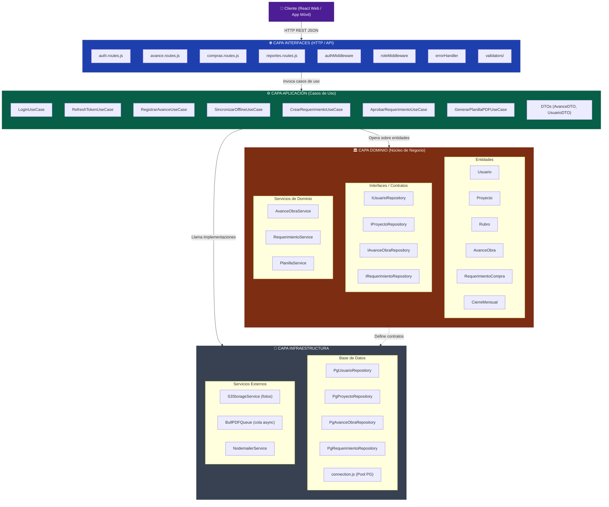
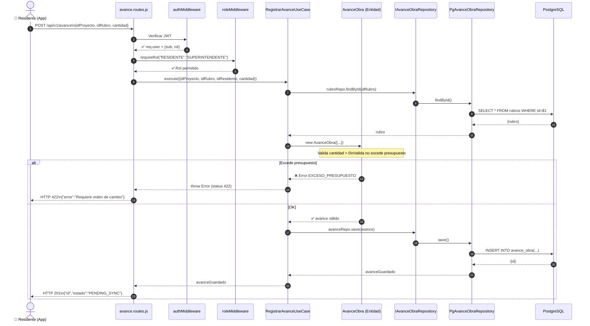
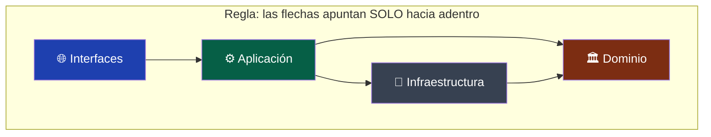
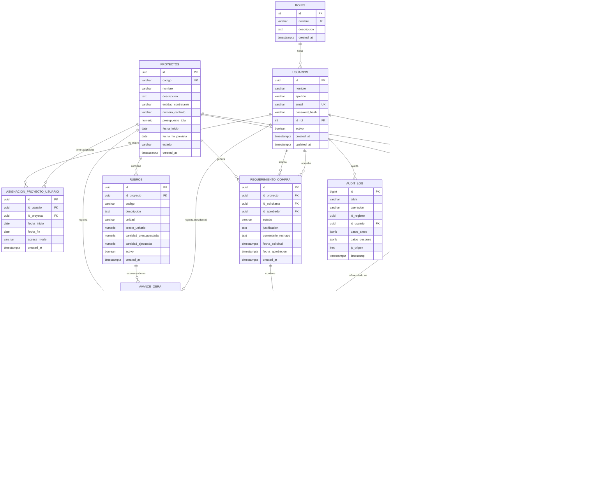
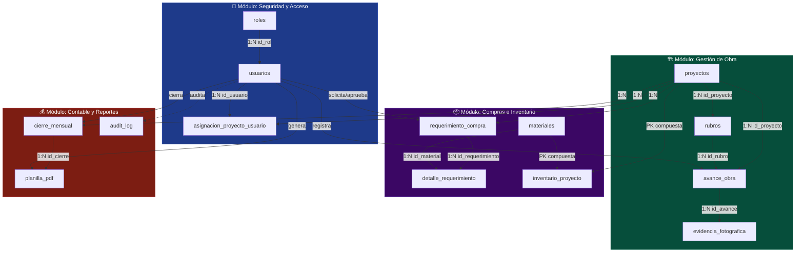
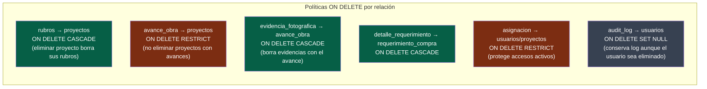
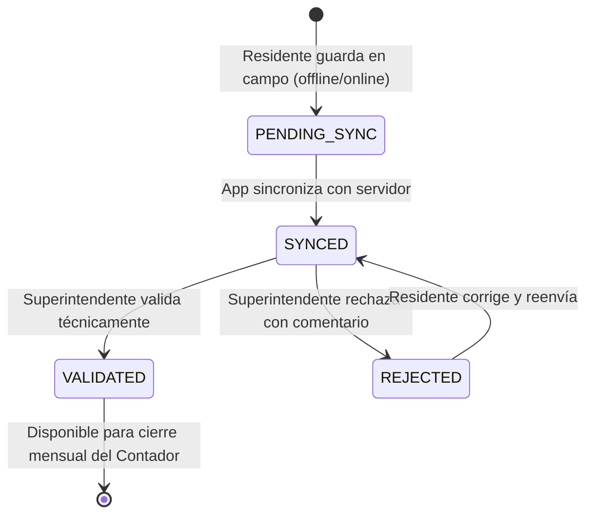
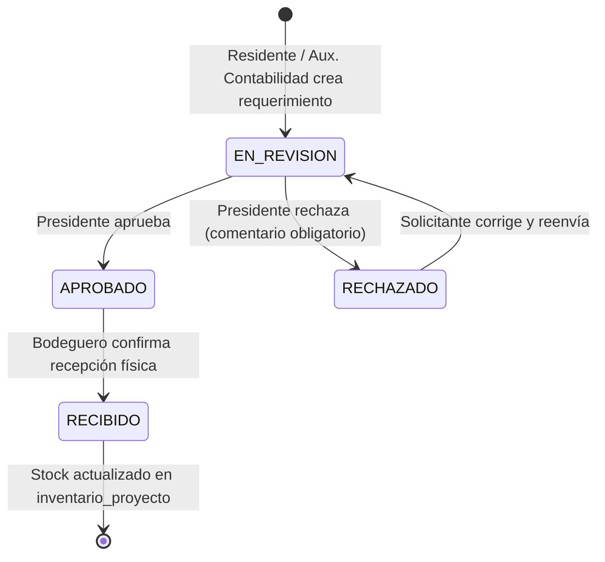
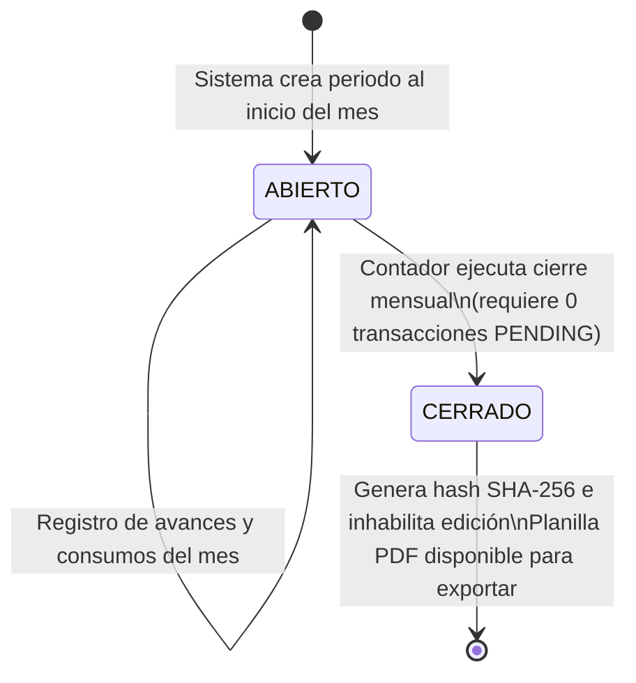

# Diagramas — Sistema ICARO CONSTRUCTORES

---

## 1. Arquitectura por Capas (HT-01)

### 1.1 Vista general de capas y dependencias

---

### 1.2 Flujo de una solicitud — Registrar Avance de Obra

---

### 1.3 Mapa de dependencias entre capas (regla de dependencias)

---

## 2. Esquema Relacional PostgreSQL (HT-04)

### 2.1 Diagrama Entidad-Relación completo

---

### 2.2 Módulos agrupados con flujos clave

---

### 2.3 Políticas de integridad referencial

---

### 2.4 Flujo de estados — Avance de Obra

---

### 2.5 Flujo de estados — Requerimiento de Compra

---

### 2.6 Flujo de estados — Cierre Mensual

