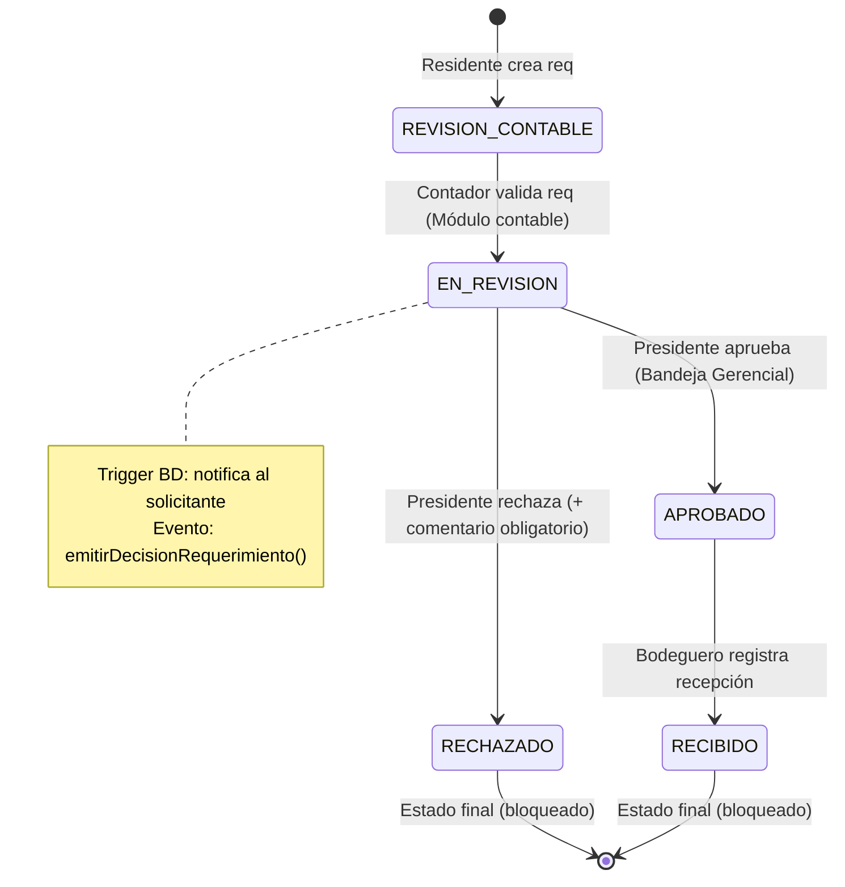
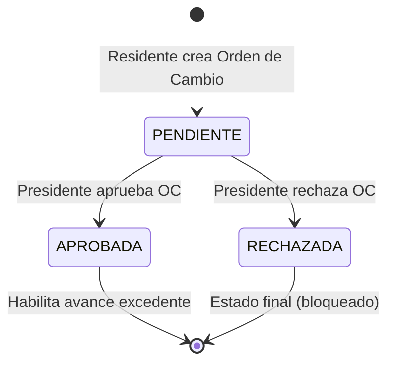

# Sprint 7 — ICARO CONSTRUCTORES: Implementación Completa

## Resumen de Entregables

Este documento describe los artefactos generados para el Sprint 7 del sistema ICARO y las instrucciones de verificación manual actualizadas.

---

## Paso 1: Migración SQL — [`sprint7_migration.sql`](file:///e:/Ryzen5/Documents/Sistema_ICARO/BaseDatos/sprint7_migration.sql)

### Nuevas estructuras

| Objeto | Tipo | Propósito |
|---|---|---|
| `ordenes_cambio` | Tabla | Soporta Actividad 4: excedentes con OC aprobada |
| `notificaciones_sistema` | Tabla | Persiste alertas internas para Actividad 2 |
| `bloquear_reprocesamiento_requerimiento` | Trigger | CA Act. 3: estados APROBADO/RECHAZADO son finales |
| `notificar_decision_requerimiento` | Trigger | CA Act. 2: notifica al solicitante en el DB level |
| `validar_excedente_con_orden_cambio` | Función PL/pgSQL | CA Act. 4: retorna JSON con permiso/margen |
| `v_bandeja_gerencial` | Vista | Optimiza la consulta de la bandeja gerencial |
| Índices de auditoría | Índices | Mejora trazabilidad E2E (Actividad 5) |

> [!IMPORTANT]
> Ejecutar dentro de una transacción. Los triggers trabajan a nivel de BD como segunda línea de defensa. La primera línea es la lógica en el service (Node.js).

---

## Paso 2: Backend

### Nuevos archivos

| Archivo | Descripción |
|---|---|
| [`ordenCambio.service.js`](file:///e:/Ryzen5/Documents/Sistema_ICARO/backend/src/services/ordenCambio.service.js) | Lógica de negocio: crear, aprobar, rechazar OC y `validarExcedentePorOrdenCambio` |
| [`ordenCambio.controller.js`](file:///e:/Ryzen5/Documents/Sistema_ICARO/backend/src/controllers/ordenCambio.controller.js) | Controlador HTTP — delega al service |
| [`ordenesCambio.routes.js`](file:///e:/Ryzen5/Documents/Sistema_ICARO/backend/src/routes/ordenesCambio.routes.js) | Rutas con RBAC: `POST`, `GET`, `PUT /aprobar`, `PUT /rechazar`, `GET /validar-excedente` |
| [`audit.routes.js`](file:///e:/Ryzen5/Documents/Sistema_ICARO/backend/src/routes/audit.routes.js) | **NUEVO**: Endpoint `GET /api/v1/audit-logs` con filtros y paginación (solo Admin) |

### Archivos modificados

| Archivo | Cambio |
|---|---|
| [`notification.service.js`](file:///e:/Ryzen5/Documents/Sistema_ICARO/backend/src/services/notification.service.js) | Añade `emitirDecisionRequerimiento` + handler que persiste en `notificaciones_sistema` y `audit_log` |
| [`compras.service.js`](file:///e:/Ryzen5/Documents/Sistema_ICARO/backend/src/services/compras.service.js) | `aprobarRequerimiento` y `rechazarRequerimiento` disparan `emitirDecisionRequerimiento` |
| [`avance.controller.js`](file:///e:/Ryzen5/Documents/Sistema_ICARO/backend/src/controllers/avance.controller.js) | Bloqueo de avance excedente consulta la OC aprobada antes de rechazar |
| [`server.js`](file:///e:/Ryzen5/Documents/Sistema_ICARO/backend/src/server.js) | Registra `/api/v1/ordenes-cambio` y `/api/v1/audit-logs` |
| [`schema.prisma`](file:///e:/Ryzen5/Documents/Sistema_ICARO/backend/prisma/schema.prisma) | Añade modelos `OrdenCambio` y `NotificacionSistema` con relaciones |

### API de Órdenes de Cambio

```
POST   /api/v1/ordenes-cambio/proyectos/:idProyecto    → Crear OC (Residente, Admin, Presidente)
GET    /api/v1/ordenes-cambio/proyectos/:idProyecto    → Listar OCs (+ Contador)
PUT    /api/v1/ordenes-cambio/:id/aprobar              → Aprobar (Admin, Presidente)
PUT    /api/v1/ordenes-cambio/:id/rechazar             → Rechazar (Admin, Presidente)
GET    /api/v1/ordenes-cambio/validar-excedente        → Consulta pre-avance (?idRubro&cantidadAvance)
```

### API de Auditoría (NUEVA — Actividad 5)

```
GET    /api/v1/audit-logs    → Consulta paginada de audit_log (solo Admin)
  Query params:
    limit, offset
    tabla       (ej: requerimiento_compra)
    operacion   (INSERT | UPDATE | DELETE)
    idUsuario   (UUID)
    idRegistro  (UUID)
    desde, hasta (ISO date)
```

---

## Paso 3: Frontend

### Archivos modificados

| Archivo | Cambio |
|---|---|
| [`BandejaGerencialView.jsx`](file:///e:/Ryzen5/Documents/Sistema_ICARO/frontend/src/views/compras/BandejaGerencialView.jsx) | Eliminado subtítulo "Sprint 7". Tabs Aprobados/Rechazados ahora recargan desde servidor tras cada acción. |
| [`BuzonContableView.jsx`](file:///e:/Ryzen5/Documents/Sistema_ICARO/frontend/src/views/compras/BuzonContableView.jsx) | Corregido import de `rechazarRequerimiento`. Eliminado subtítulo "Sprint 7". Tabs recargan desde servidor. |
| [`AuditTraceabilityView.jsx`](file:///e:/Ryzen5/Documents/Sistema_ICARO/frontend/src/views/auditoria/AuditTraceabilityView.jsx) | **Reescrito**: ahora consume datos reales del backend. Reemplaza completamente el mockup anterior. |

### Nuevos archivos (Frontend)

| Archivo | Descripción |
|---|---|
| [`audit.service.js`](file:///e:/Ryzen5/Documents/Sistema_ICARO/frontend/src/services/audit.service.js) | Capa de API para `fetchAuditLogs()` con soporte de filtros |
| [`ordenesCambio.service.js`](file:///e:/Ryzen5/Documents/Sistema_ICARO/frontend/src/services/ordenesCambio.service.js) | Capa de API: crearOrdenCambio, aprobarOrdenCambio, validarExcedentePresupuesto |

---

## Paso 4: Tests E2E

### [`sprint7_gerencial_ordenes.test.js`](file:///e:/Ryzen5/Documents/Sistema_ICARO/backend/tests/sprint7_gerencial_ordenes.test.js)

**46 tests** organizados en grupos:

| Grupo | Tests | Actividad |
|---|---|---|
| Actividad 1: Bandeja Gerencial | 7 | CA: Presidente/Gerente visualiza solicitudes autorizadas |
| Actividad 2: Aprobación/Rechazo | 10 | CA: Aprobación→APROBADO, rechazo exige comentario, notifica |
| Actividad 3: Bloqueo de Reprocesamiento | 4 | CA: estados finales no se reprocesan |
| Actividad 4: Órdenes de Cambio | 13 | CA: excedente sin OC bloqueado; con OC aprobada permitido |
| Actividad 5: Trazabilidad E2E | 8 | CA: ciclo registrado en BD y audit_log |
| Seguridad RBAC adicional | 4 | Validación de todos los roles en nuevos endpoints |

---

## Flujo de estados del sistema



> [!NOTE]
> **¿Dónde se guardan los registros?**
> Cada acción de aprobación, rechazo o validación genera una entrada en la tabla `audit_log` de PostgreSQL (inmutable). El módulo de Trazabilidad y Auditoría en el panel del Administrador del Sistema consulta directamente esta tabla en tiempo real vía `GET /api/v1/audit-logs`.

---

## Detalle de Cumplimiento Técnico (Actividades 2 y 3)

### Actividad 2: Aprobación y rechazo con comentario obligatorio, cambio de estado y notificación al creador

Esta actividad se cumple a través de una arquitectura de tres capas (Base de datos, Backend y Frontend):

#### 1. Capa de Base de Datos (PostgreSQL)
*   **Tabla [`notificaciones_sistema`](file:///e:/Ryzen5/Documents/Sistema_ICARO/BaseDatos/sprint7_migration.sql#L56-L69):** Almacena y persiste los mensajes dirigidos a cada usuario, registrando el tipo (`APROBADO` o `RECHAZADO`), el título, el mensaje detallado y las referencias al requerimiento de compra afectado.
*   **Trigger [`trg_notificar_decision`](file:///e:/Ryzen5/Documents/Sistema_ICARO/BaseDatos/sprint7_migration.sql#L171-L175) y Función [`notificar_decision_requerimiento()`](file:///e:/Ryzen5/Documents/Sistema_ICARO/BaseDatos/sprint7_migration.sql#L123-L170):** Este gatillo a nivel de base de datos se ejecuta de forma automática `AFTER UPDATE OF "estado"` en la tabla `requerimiento_compra`. Si el estado cambia a `APROBADO` o `RECHAZADO`, inserta una notificación en la tabla `notificaciones_sistema` dirigida al solicitante original del requerimiento (`NEW.id_solicitante`), incluyendo el comentario de rechazo (`NEW.comentario_rechazo`) en caso de denegación.

#### 2. Capa de Backend (Node.js & Prisma)
*   **Validación de Comentario Obligatorio en [`compras.service.js`](file:///e:/Ryzen5/Documents/Sistema_ICARO/backend/src/services/compras.service.js#L275-L319):**
    *   La función `rechazarRequerimiento` valida rigurosamente que el parámetro `comentarioRechazo` no sea nulo ni esté vacío (ej. `"   "`). Si no se suministra un motivo válido, lanza un error con código `400 Bad Request` indicando: *"El comentario de rechazo es obligatorio."*.
*   **Emisión de Decisiones y Notificaciones:**
    *   Tanto `aprobarRequerimiento` como `rechazarRequerimiento` invocan a la función `emitirDecisionRequerimiento` de [`notification.service.js`](file:///e:/Ryzen5/Documents/Sistema_ICARO/backend/src/services/notification.service.js#L152-L219).
    *   Esta función utiliza un `EventEmitter` para procesar el evento en segundo plano. Registra un log inmutable de auditoría en la tabla `audit_log` (Actividad 5) y escribe de forma complementaria la alerta correspondiente en `notificaciones_sistema`.

#### 3. Capa de Frontend (React)
*   **Validación en Interfaz de Usuario:**
    *   En [`BandejaGerencialView.jsx`](file:///e:/Ryzen5/Documents/Sistema_ICARO/frontend/src/views/compras/BandejaGerencialView.jsx), al presionar el botón de rechazar, se abre un Drawer/Modal donde el campo de texto del comentario es obligatorio.
    *   El botón de confirmación se mantiene bloqueado (`disabled`) hasta que el usuario digite un comentario con texto válido (no vacío).
*   **Visualización de la Alerta:**
    *   Cuando el solicitante (Residente) inicia sesión, su campanilla de notificaciones y panel correspondiente consultan las alertas guardadas en `notificaciones_sistema` para ver si sus requerimientos fueron aprobados o rechazados (con sus respectivos comentarios).

---

### Actividad 3: Integrar requerimientos aprobados con recepción de materiales y bloquear reprocesamiento de estados finales

Esta actividad asegura la integridad lógica de las solicitudes mediante bloqueos estrictos a nivel de servidor y base de datos, y canaliza únicamente las compras válidas al inventario:

#### 1. Capa de Base de Datos (PostgreSQL — Seguridad a nivel transaccional)
*   **Trigger [`trg_bloquear_reprocesamiento`](file:///e:/Ryzen5/Documents/Sistema_ICARO/BaseDatos/sprint7_migration.sql#L112-L116) y Función [`bloquear_reprocesamiento_requerimiento()`](file:///e:/Ryzen5/Documents/Sistema_ICARO/BaseDatos/sprint7_migration.sql#L80-L110):**
    *   Se ejecuta `BEFORE UPDATE OF "estado"` sobre la tabla `requerimiento_compra` para validar las transiciones de estado permitidas.
    *   **Si el estado actual es `RECHAZADO` o `RECIBIDO`:** Bloquea inmediatamente cualquier intento de actualización lanzando la excepción `REPROCESAMIENTO_BLOQUEADO` con SQLSTATE `P0001`.
    *   **Si el estado actual es `APROBADO`:** Solo se permite avanzar al estado `RECIBIDO` (realizado cuando bodega registra la recepción de materiales). Intentos de retroceder el requerimiento a `EN_REVISION` o `REVISION_CONTABLE` son denegados por la base de datos.

#### 2. Capa de Backend (Node.js — Seguridad a nivel de servicios)
*   **Validación de Estado en [`compras.service.js`](file:///e:/Ryzen5/Documents/Sistema_ICARO/backend/src/services/compras.service.js#L229-L265):**
    *   Antes de aplicar cualquier cambio, el servicio lee el estado actual del requerimiento. Si no se encuentra en `EN_REVISION`, detiene el flujo y lanza un error con código `409 Conflict`, indicando por ejemplo: *"Solo se pueden aprobar requerimientos en estado EN_REVISION."*.
    *   Esto actúa como la primera línea de defensa antes de delegar la transacción a PostgreSQL.

#### 3. Integración con Recepción (Bodega)
*   **Filtrado de Solicitudes Disponibles:**
    *   El módulo de Bodega (`InventoryReceptionView.jsx`) y el servicio de consultas de requerimientos filtran las solicitudes para que **únicamente** los requerimientos en estado `APROBADO` queden visibles y elegibles para la recepción física en obra.
    *   Una vez que el Bodeguero completa la recepción, el estado del requerimiento cambia a `RECIBIDO` (marcando la conclusión exitosa del flujo y su bloqueo definitivo para futuros reprocesamientos).

---

## Guías de verificación manual

### Flujo 1: Ciclo de Requerimientos de Compra (Actividades 1, 2, 3)

1. **Creación del Requerimiento (Residente):**
   - Inicie sesión como **Residente** (ej. `residente@icaro.com` / `Icaro12345*`).
   - Diríjase al módulo **Requerimientos** (Requerimientos de Compra).
   - Seleccione un proyecto en el desplegable superior.
   - Haga clic en **Nuevo requerimiento**, ingrese una justificación y agregue al menos un material con cantidad ≥ 1.
   - Guarde. El requerimiento se creará en estado `REVISION_CONTABLE`.
   - **Toast esperado:** _"Requerimiento ingresado correctamente. Se ha notificado al contador."_

2. **Validación Contable (Contador):**
   - Inicie sesión como **Contador** (`contador@icaro.com` / `Icaro12345*`).
   - Módulo **Requerimientos** → pestaña **Pendientes**.
   - Clic en la fila para desplegar el drawer → **Validar Requerimiento** → Confirmar.
   - **Toast esperado:** _"Requerimiento validado. Se ha notificado al gerente."_
   - El requerimiento pasa a estado `EN_REVISION`.

3. **Aprobación o Rechazo (Presidente / Gerente):**
   - Inicie sesión como **Presidente / Gerente** (`gerencia@icaro.com` / `Icaro12345*`).
   - Módulo **Revisar requerimientos** (Bandeja Gerencial) → pestaña **Pendientes**.
   - **Para Aprobar:** Drawer → **Aprobar Requerimiento** → Confirmar.
     - **Toast esperado:** _"Requerimiento aprobado. Se ha notificado al bodeguero y al solicitante."_
     - El requerimiento pasa a `APROBADO` (visible en pestaña Aprobados).
   - **Para Rechazar:** Ingrese un motivo obligatorio → **Rechazar con motivo**.
     - **Toast esperado:** _"Requerimiento rechazado. Se ha notificado al solicitante."_
     - El requerimiento pasa a `RECHAZADO` (visible en pestaña Rechazados con el motivo en rojo).
   - *Seguridad (Act. 3):* Re-aprobar o re-rechazar lanza error 409 bloqueando el reprocesamiento.

4. **Recepción en Bodega (Bodeguero):**
   - Inicie sesión como **Bodeguero** (`bodega@icaro.com` / `Icaro12345*`).
   - **Recepción de Inventario** — Solo requerimientos en estado `APROBADO` aparecen disponibles.

---

### Flujo 2: Sobregiros y Órdenes de Cambio (Actividad 4)

1. **Intento de Registro de Avance Excedente (Residente):**
   - Módulo **Registro de Avances** → intente registrar un avance físico que supere el presupuesto del rubro.
   - El sistema bloqueará con aviso rojo indicando que se requiere una Orden de Cambio.

2. **Creación de Orden de Cambio (Residente):**
   - Menú lateral → **Órdenes de Cambio**.
   - Clic en **Nueva Orden de Cambio**, seleccione rubro y proyecto, especifique cantidad adicional y justificación.
   - La orden queda en estado `PENDIENTE`.

3. **Aprobación de la Orden (Presidente / Gerente):**
   - Módulo **Órdenes de Cambio** → localice la solicitud pendiente → **Aprobar**.
   - La orden cambia a `APROBADA`.

4. **Registro Exitoso del Avance (Residente):**
   - Vuelva a **Registro de Avances** e intente el mismo avance.
   - Ahora el sistema lo permite dentro del nuevo límite autorizado.

---

### Flujo 3: Trazabilidad y Auditoría E2E (Actividad 5)

1. **Consulta de Auditoría (Admin):**
   - Inicie sesión como **Administrador del Sistema** (`admin@icaro.com` / `Icaro12345*`).
   - Módulo **Trazabilidad y Auditoría**.
   - La vista muestra **datos reales** de la tabla `audit_log` de PostgreSQL (no mockup).
   - Cada fila corresponde a una acción registrada automáticamente por el sistema.

2. **Filtros disponibles:**
   - Por tabla (requerimiento de compra, usuarios, proyectos, inventario, etc.)
   - Por operación (Creación / Edición / Eliminación)
   - Por rango de fechas (desde / hasta)
   - Búsqueda de texto en página actual

3. **Expansión de filas:**
   - Haga clic en cualquier fila para ver el detalle completo:
     - **datos_antes**: estado del registro antes de la operación (null en creaciones)
     - **datos_despues**: estado nuevo o payload del evento (null en eliminaciones)
     - **UUID del registro** afectado

4. **¿Qué se registra en audit_log?**

| Evento | Tabla | Operación | Gatillo |
|---|---|---|---|
| Residente crea requerimiento | `requerimiento_compra` | INSERT | `crearRequerimiento()` |
| Contador valida requerimiento | `requerimiento_compra` | UPDATE | `validarRequerimientoContable()` |
| Gerente aprueba requerimiento | `requerimiento_compra` | UPDATE | `aprobarRequerimiento()` |
| Gerente rechaza requerimiento | `requerimiento_compra` | UPDATE | `rechazarRequerimiento()` |
| Residente crea Orden de Cambio | `ordenes_cambio` | INSERT | `crearOrdenCambio()` |
| Gerente aprueba OC | `ordenes_cambio` | UPDATE | `aprobarOrdenCambio()` |
| Cualquier PUT/POST/DELETE | Varias | INSERT/UPDATE/DELETE | `auditMiddleware` (global) |



---

## Pasos para aplicar la migración

> [!CAUTION]
> Ejecutar en este orden exacto para evitar errores de FK.

```bash
# 1. Aplicar la migración SQL manualmente
psql -U <user> -d <database> -f BaseDatos/sprint7_migration.sql

# 2. Regenerar el cliente Prisma
cd backend
npx prisma db pull      # Verificar que los modelos nuevos se detectan
npx prisma generate     # Regenerar el cliente

# 3. Ejecutar los tests del Sprint 7
npx jest tests/sprint7_gerencial_ordenes.test.js --no-coverage

# 4. Ejecutar la suite completa para detectar regresiones
npx jest --no-coverage
```
